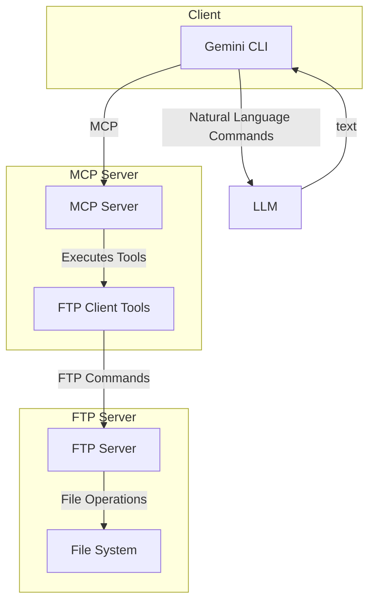

# Project Specification: Python MCP Server

## 1. Overview

This document outlines the specification for the Python MCP Server project. The project consists of two main components: a standalone FTP server and an MCP (Multi-purpose Cooperative Protocol) server. The MCP server provides a set of tools to interact with the FTP server, allowing for file management operations through a natural language interface.

## 2. System Architecture

The system is composed of two independent servers that communicate with each other.

- **FTP Server**: A standard FTP server for file storage and retrieval.
- **MCP Server**: A server that exposes a set of tools to be used by a client (e.g., Gemini CLI). These tools, in turn, interact with the FTP server.

### 2.1. Flowchart

## 3. Components

### 3.1. FTP Server (`ftp_server.py`)

-   **Functionality**: Provides a standard FTP service.
-   **Host**: 0.0.0.0
-   **Port**: 2121
-   **User**: `user`
-   **Password**: `12345`
-   **Home Directory**: `ftp_home/`

### 3.2. MCP Server (`server.py`)

-   **Functionality**: Exposes a set of tools for interacting with the FTP server.
-   **Tools**:
    -   `ftp_connect`: Establishes a connection to the specified FTP server.
    -   `ftp_disconnect`: Closes the current connection to the FTP server.
    -   `ftp_list`: Retrieves a detailed list of files and directories in the current path.
    -   `ftp_nlst`: Returns a simple list of file names in the directory (names only).
    -   `ftp_mlsd`: Lists file details in a machine-readable format (standardized facts).
    -   `ftp_retrieve_file`: Downloads a specific file from the server to the local machine.
    -   `ftp_store_file`: Uploads a file from the local machine to the server.
    -   `ftp_store_file_unique`: Uploads a file with a unique name generated by the server to avoid overwrites.
    -   `ftp_cwd`: Changes the current working directory on the server.
    -   `ftp_rename`: Renames a file or directory on the server.
    -   `ftp_mkdir`: Creates a new directory on the server.
    -   `ftp_rmdir`: Removes an empty directory from the server.
    -   `ftp_abort_transfer`: Aborts an ongoing file transfer.
    -   `ftp_cdup_directory`: Moves the current working directory up one level (parent directory).
    -   `ftp_get_file_size`: Returns the size of a specific file on the server.
    -   `ftp_send_command`: Sends a raw custom command string directly to the FTP server.
    -   `ftp_void_command`: Sends a command expecting a successful response code but no return data.
    -   `ftp_delete_recursive`: Recursively deletes a directory and all of its contents.
    -   `ftp_copy_recursive`: Recursively copies a directory and its contents to a new location.
