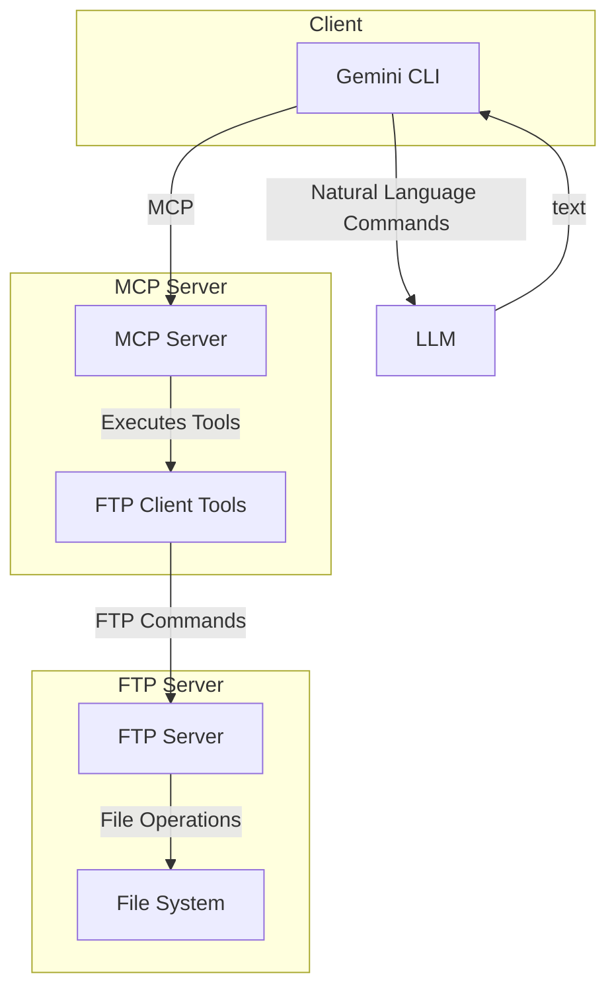

# Project Specification: Python MCP Server

## 1. Overview

This document outlines the specification for the Python MCP Server project. The project consists of two main components: a standalone FTP server and an MCP (Multi-purpose Cooperative Protocol) server. The MCP server provides a set of tools to interact with the FTP server, allowing for file management operations through a natural language interface.

## 2. System Architecture

The system is composed of two independent servers that communicate with each other.

- **FTP Server**: A standard FTP server for file storage and retrieval.
- **MCP Server**: A server that exposes a set of tools to be used by a client (e.g., Gemini CLI). These tools, in turn, interact with the FTP server.

### 2.1. Flowchart

## 3. Components

### 3.1. FTP Server (`ftp_server.py`)

-   **Functionality**: Provides a standard FTP service.
-   **Host**: 0.0.0.0
-   **Port**: 2121
-   **User**: `user`
-   **Password**: `12345`
-   **Home Directory**: `ftp_home/`

### 3.2. MCP Server (`server.py`)

-   **Functionality**: Exposes a set of tools for interacting with the FTP server.
-   **Tools**:
    -   `ftp_connect`: Connect to the FTP server.
    -   `ftp_disconnect`: Disconnect from the FTP server.
    -   `ftp_list`: List files and directories.
    -   `ftp_get`: Download a file from the FTP server.
    -   `ftp_put`: Upload a file to the FTP server.
    -   `ftp_cd`: Change the current directory on the FTP server.
    -   `greet`: A simple tool to return a greeting.

## 4. Future Development

### 4.1. Additional Features

-   **Asynchronous Support**: Introduce asynchronous capabilities to the MCP server to handle multiple client requests  concurrently without blocking.
-   **Web Interface**: A web-based interface for managing the servers and viewing logs.
-   **Anonymous FTP Support**: Allow optional anonymous access to the FTP server for public file sharing, without requiring user authentication.
-   **Logging**: Implement a logging system to record all server activity.
-   **Error Handling**: Improve error handling and provide more informative error messages.

### 4.2. MCP Tool Expansion

-   **Recursive Operations**: Implement recursive logic for file operations such as `copy`, `delete`, and `move`. For example, a user should be able to request to copy an entire folder, and the server will recursively copy all files and subfolders within it.

